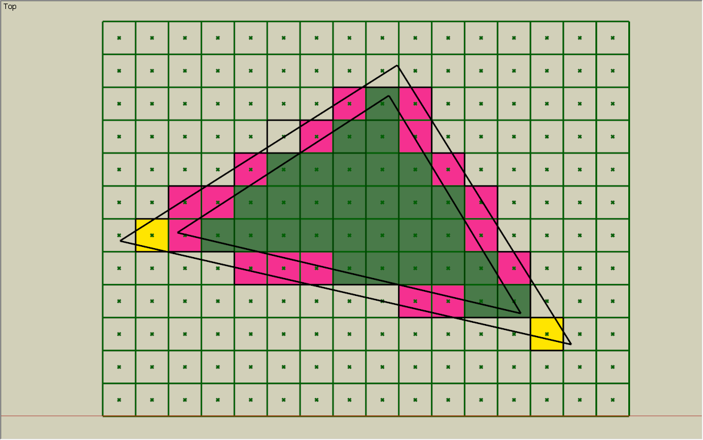

# WebGL

### Subtitle

---

## Key Goals:

* Basic understanding of what WebGL is
* Basic knowledge of how *things* get drawn
* We'll draw in WebGL using a Vertex Buffer
* Learn a little bit about matrices and how they relate
* Possibly someone will make something move in 3D

---

## What is WebGL?

* Can draw 2D and 3D shapes
* Integrates with `<canvas/>`
* GPU Accelerated
* Based on OpenGL ES (mobile)
* Works in Modern/Current Browsers

---

## What is WebVR?

 * Already deprecated
 * WebXR
 * Basically... Render twice as much `<canvas/>` 
 * And Render it twice (per eye)
 * [A-Frame](https://aframe.io/)
 * [ReactVR](https://facebook.github.io/react-vr/)

---

## WebGL basics: GPU?

* Composition
   * Lists of things we want displayed
   * Hardware sorting and ordering these
* Rasterization
   * Understood shapes become pixels
   * Triangles, Bitmaps
* Programmable
   * "Shaders"
   * GPGPU ;)

---

## WebGL basics: Triangles

* Triangles create shapes
* Easy to rasterize
* Rasterize: "Draw"

---

## WebGL basics: Polygon Soup

* List of Polygons
* Typically list(s) of Vertices
  * 3 vertices = 1 triangle
* Vertex Format
  * Position
  * Color
  * Texture Coordinates (2D)
  * Normal
  * Tangent
  * Binormal/bitangent 
    * cross product of normal/tangent

---

### FIDDLE
[JS-Fiddle](https://jsfiddle.net/argylelabcoat/xd70q5fr/16/)

---

### Vectors

 * For us, essentially a collection of associated numbers
 * But, yes, usually a mathematical vector (direction with magnitude)
 * Sometimes people use vectors to store related values
 
 `[x, y, z, w ===1]`

---

### Matrices:

 * Projection (perspective)
 * Model (object position, orientation, scale)
   * essentially a Transform or SRT Matrix
 * View (world/camera)

---

### Matrix Math!

 * Matrix concatenation
   * Order Matters!
   * transform = S * R * T
 * [glMatrix](http://glmatrix.net/) is helpful
   * Typed out in Row Major
   * Documentation for Graphics often Column Major
 * Rotation from Euler Angles...
   * Bad! Gimbal-Lock
   * But, that's how I'll show you

--- 

### Matrix Composition

 Identity
 
$$\begin{pmatrix}
1 &0 & 0 & 0\\\ 
0 & 1 & 0  & 0\\\ 
0 & 0 & 1  & 0\\\ 
0 & 0 & 0  & 1 \end{pmatrix}$$

--- 

### Matrix Composition

 Scaling

$$\begin{pmatrix}
x &0 & 0 & 0\\\ 
0 & y & 0  & 0\\\ 
0 & 0 & z  & 0\\\ 
0 & 0 & 0  & 1 \end{pmatrix}$$

--- 

### Matrix Composition

 Translation

$$\begin{pmatrix}
1 &0 & 0 & x\\\ 
0 & 1 & 0  & y\\\ 
0 & 0 & 1  & z\\\ 
0 & 0 & 0  & 1 \end{pmatrix}$$

--- 

### Matrix Composition

 Rotation X

$$\begin{pmatrix}
1 &0 & 0 & 0\\\ 
0 & cos & -sin  & 0\\\ 
0 & sin & cos  & 0\\\ 
0 & 0 & 0  & 1 \end{pmatrix}$$

--- 

### Matrix Composition

 Rotation Y

$$\begin{pmatrix}
cos &0 & sin & 0\\\ 
0 & 1 & 0  & 0\\\ 
-sin & 0 & cos  & 0\\\ 
0 & 0 & 0  & 1 \end{pmatrix}$$

--- 

### Matrix Composition

 Rotation Z

$$\begin{pmatrix}
cos & -sin & 0 & 0\\\ 
sin & cos & 0  & 0\\\ 
0 & 0 & 1  & 0\\\ 
0 & 0 & 0  & 1 \end{pmatrix}$$

---

### Final Links

 * [Blender](https://www.blender.org/)
 * [ThreeJS](https://github.com/mrdoob/three.js)
 * [BabylonJS](https://www.babylonjs.com/)
 * [SpectorJS](http://spector.babylonjs.com/)
 * [Unity](https://unity3d.com/)
